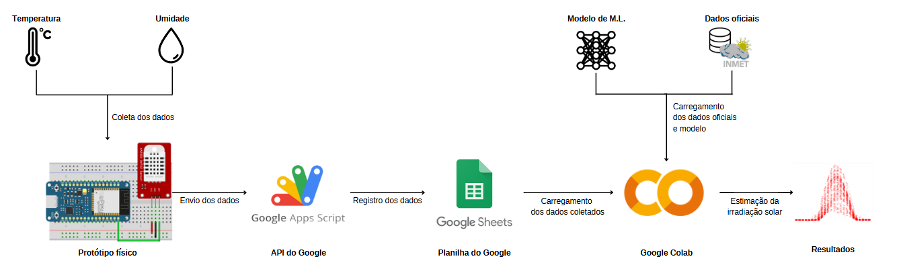

## Overview

This project involves the development of a prototype to collect temperature and humidity data using a DHT22 sensor connected to an ESP32 microcontroller. The collected data is then sent to Google Sheets via a Google Apps Script for storage and further analysis. A machine learning model is used to analyze the data and estimate solar radiation, providing valuable insights for various applications.

## Components

- **ESP32 WROOM-32**: A powerful microcontroller with built-in Wi-Fi and Bluetooth capabilities.
- **DHT22 Sensor**: A digital sensor that measures temperature and humidity with high accuracy.
- **Google Apps Script**: A serverless JavaScript environment that allows you to extend Google Apps and automate tasks.
- **Google Sheets**: A cloud-based spreadsheet application used to store and visualize data.
- **Google Colab**: An interactive Python notebook environment that facilitates machine learning and data analysis.

## Process

### Data Collection

1. **Temperature and Humidity Measurement**: The DHT22 sensor collects temperature and humidity data.
2. **Data Transmission**: The ESP32 microcontroller reads the data from the DHT22 sensor and sends it to the Google Apps Script via a secure HTTP request.
   
### Data Registration

3. **Google Apps Script**: Receives the data from the ESP32 and logs it in a Google Sheets document. The script parses the incoming data and registers the temperature and humidity values along with the current date and time.

### Data Analysis

4. **Google Sheets**: The collected data is stored in Google Sheets, where it can be easily accessed and visualized.
5. **Machine Learning Model**: A machine learning model is developed to analyze the collected data and predict solar radiation. The model uses both the collected data and official data from INMET (National Institute of Meteorology).

### Visualization and Results

6. **Google Colab**: The machine learning model is executed in Google Colab, which processes the data and generates predictions.
7. **Results Display**: The results, including graphs and performance metrics, are displayed to provide insights into the
